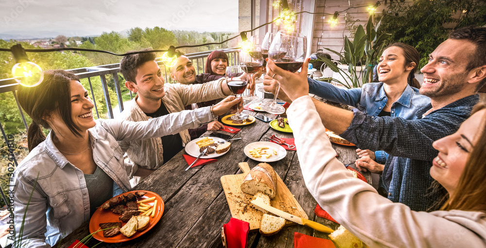

# Dinner Optimization

so you're me and having a dinner party (picture below related).  

The big problem.  
WHO SITS WHERE ?!?!  
Using this algo you can optimize this problem.  
We can sit people around a table to both maximize their familiarity with each other and minimize it.  
By filling out the guest list at the **guests** array and following the simple steps rating everyones familiarity to each 
other from 1-5 and setting it to either minimize or maximize it will create the optimal seating arrangement.   
yippie yahoo now go have fun !  
ooooo also make sure to install the dependencies very important